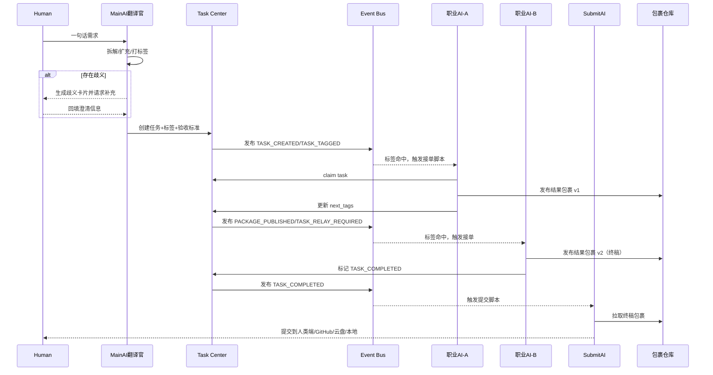

# RelayHive 架构开发规划计划书（V1.0）

> 项目定位：Distributed AI Task Operating System（分布式 AI 任务操作系统）
> 
> 中文代号：蚁巢（Relay + Hive）

---

## 1. 项目定位与目标

### 1.1 项目定位
RelayHive 是一个**面向任务接力的 AI 协作底层架构**，定位类似 AOSP / 小程序容器：
- 不定义“应用内容”本身；
- 只定义“任务如何被规范接力、验证、沉淀、交付”。

### 1.2 核心目标
- 将人类需求转化为可执行的任务链；
- 以标签协议和脚本规则驱动职业 AI 接力；
- 以结果包裹链替代无限上下文；
- 建立可审计、可回放、可扩展的 AI 工业流水线。

### 1.3 V1 成功标准
- 至少跑通 1 条端到端任务接力链：主AI翻译官 → 职业AI-A → 职业AI-B → 提交AI；
- 标签协议可稳定驱动“接单/禁行/阶段推进”；
- 结果包裹仓库支持按 task_id 追踪 7 天以上迭代链。

---

## 2. 核心理念与区别于传统 Agent 架构的创新

### 2.1 RelayHive 核心理念
1. **任务流即长期上下文**（不是对话堆栈即上下文）；
2. **阶段成果即长期记忆**（不是向量召回即记忆）；
3. **强协议协作优先于自然语言猜测**；
4. **职业化分工优先于万能 Agent**。

### 2.2 与传统架构对比
| 维度 | 传统单体 Agent | RelayHive |
|---|---|---|
| 协作方式 | 对话驱动 | 事件 + 标签协议驱动 |
| 上下文策略 | 长上下文持续注入 | 结果包裹链 + 胶囊化输入 |
| 扩展模式 | 加提示词 | 新职业AI=标签协议+脚本规则+工具包 |
| 可审计性 | 弱 | 强（任务中心 + 事件总线 + 包裹仓库） |
| 稳定性 | 易循环跑偏 | 通过阶段接力降低漂移 |

### 2.3 关键创新点
- **权重前缀 + 标注后缀标签协议**（如 `#1_需要设计`、`#2_禁止编程`）；
- **主AI翻译官机制**：负责拆解/扩充/歧义卡片二次澄清；
- **结果包裹仓库链**：所有阶段产物以版本链保留，支持追溯；
- **成功失败经验记忆**：只保存“可复用纠偏路径”，不保存污染性失败内容。

---

## 3. 项目模块与系统边界说明

### 3.1 系统核心模块
1. **Main AI Translator（主AI翻译官）**
2. **Task Center（任务中心）**
3. **Tag Protocol Engine（标签协议引擎）**
4. **Relay Script Runtime（脚本规则运行时）**
5. **Event Bus（事件总线）**
6. **Result Package Registry（结果包裹仓库）**
7. **Success-Failure Memory（成功失败经验库）**
8. **Delivery Gateway（提交网关：人类端/GitHub/云盘/本地）**

### 3.2 系统边界
**RelayHive 负责：**
- 协议、路由、接力、验收、沉淀、交付。

**RelayHive 不负责：**
- 具体职业 AI 模型训练；
- UI 创意产出本身；
- 某单一业务领域知识正确性兜底。

### 3.3 外部依赖边界
- LLM 服务（多模型）；
- 文件/对象存储；
- 身份认证系统（后续接入）；
- 外部工具能力（MCP、搜索、代码执行等）。

---

## 4. 设计关键点（七大机制）

### 4.1 任务中心（Task Center）
- 任务是唯一调度单元；
- 维护 DAG 依赖、状态机、所有者、包裹引用、审计日志；
- 任务状态建议：`created` → `ready` → `claimed` → `in_progress` → `handover` → `review` → `done` / `blocked` / `failed`。

### 4.2 标签协议（Tag Protocol）
#### 基础语法（建议）
- 结构：`#<权重>_<语义标签>[.<后缀>]`
- 示例：
  - `#1_需要设计`
  - `#2_需要编程`
  - `#2_禁止联网`
  - `#3_等待验收`

#### 标签层级
1. **功能标签**：任务能力需求（设计/调研/编程/翻译/审核）
2. **行为标签**：约束（禁止联网/必须人工审核/禁止覆盖）
3. **流程标签**：阶段（等待接力/处理中/等待验收/已完成）
4. **上下文标签**：输入范围（仅当前包裹/需要项目历史）

#### 冲突规则
- 权重小者优先（`#1` 高于 `#2`）；
- 同权重冲突按“禁止类 > 允许类”；
- 未定义冲突进入 `AMBIGUITY_CARD_REQUIRED`。

### 4.3 交接系统（Handover System）
每次接力必须生成交接包裹元数据：
- 目标、已完成、未完成、风险、依赖、下一棒建议、验收标准。

### 4.4 上下文胶囊（Context Capsule）
- 不限制资产体积；
- 但职业 AI 执行时只读取“本棒必要输入 + 已发布结果包裹引用”；
- 中途临时产物可废弃，最终以结果包裹为准。

### 4.5 事件总线（Event Bus）
核心事件：
- `TASK_CREATED`
- `TASK_TAGGED`
- `TASK_RELAY_REQUIRED`
- `TASK_CLAIMED`
- `PACKAGE_PUBLISHED`
- `TASK_COMPLETED`
- `TASK_BLOCKED`
- `AMBIGUITY_CARD_REQUIRED`

### 4.6 结果包裹规范（Result Package Spec）
每个包裹必须包含：
- `package_id`, `task_id`, `version`, `producer_agent`, `input_refs`, `output_manifest`, `qa_summary`, `next_tags`, `created_at`, `checksum`。

关键规则：
- 以 `task_id + version` 形成可追踪版本链；
- 每次接力递增版本；
- 最低保留 7 天；
- 允许输出存储到多后端（本地/GitHub/云盘）。

### 4.7 失败记忆系统（Success-Failure Memory）
只记录“成功纠偏经验”，如：
- 原路径失败原因（如网址变更）；
- 替代路径为何成功；
- 可复用条件和前置检查项。

不记录易污染模型行为的“失败细节沉迷内容”。

---

## 5. 典型“任务接力”全流程时序图（含角色/AI协作）



流程最小闭环：
1) 人类输入；2) 主AI翻译；3) 任务发布；4) 职业AI接力；5) 包裹迭代；6) 提交AI交付。

---

## 6. 技术栈与第一版 MVP 落地方案

### 6.1 技术栈建议
- **Backend**：Python 3.12 + FastAPI
- **DB**：PostgreSQL（任务、标签、依赖、审计）
- **Event Bus**：Redis Streams（MVP），后续 NATS/Kafka
- **Storage**：本地文件系统（MVP）+ 可插拔对象存储适配层
- **Queue/Worker**：RQ/Celery（二选一，MVP 推荐 RQ）
- **Observability**：OpenTelemetry + Prometheus + Grafana

### 6.2 MVP（8周）
- **第1-2周**：Task Center + Tag Protocol Engine + 基础状态机
- **第3-4周**：事件总线 + 脚本规则执行器 + 包裹发布 API
- **第5-6周**：2 个职业 AI 接力样例（调研→编程 或 设计→编程）
- **第7周**：提交网关（本地/GitHub）+ QA 验收流程
- **第8周**：稳定性测试、回放审计、MVP验收报告

### 6.3 MVP 产出物
- 可运行后端服务；
- 标签协议文档与样例库；
- 包裹规范 v1；
- 至少 1 条可复现接力演示链。

---

## 7. 职业 AI 职业细化与扩展可行性设计

### 7.1 接入模板（每新增职业AI必须定义）
1. **可接标签协议**（能接什么任务）
2. **脚本规则**（何时接、何时拒绝、何时转交）
3. **必要工具包**（联网/代码/绘图/文案/验证）
4. **结果包裹格式特化**（该职业的产出字段）
5. **验收条件**（可量化）

### 7.2 初始职业族建议
- PMAgent、ResearchAgent、DesignAgent、CodingAgent、QAAgent、PublishAgent、MemoryCurator。

### 7.3 扩展原则
- 新职业 AI 只通过协议接入，不改核心调度内核；
- 工具权限最小化（避免“分析AI带联网”类能力越权）；
- 每个职业有独立失败纠偏经验条目。

---

## 8. 后续演进路线与迭代计划

### 8.1 路线图
- **R1（MVP）**：接力链可用，协议可跑通；
- **R2**：主AI翻译官增强（歧义卡片体系、自动拆解质量评分）；
- **R3**：人类交互端（任务看板、包裹链浏览、审计回放）；
- **R4**：包裹仓库链升级（跨项目复用、签名校验、生命周期策略）；
- **R5**：职业AI市场化接入（标准适配器 + 安全沙箱 + 计费策略）。

### 8.2 主AI翻译官演进重点
- 一句话需求拆解器；
- 需求扩充模板库（画图/设计/分析）；
- “可完成性判定”与不可抗力标记（`#不可抗力未完成`）。

---

## 9. 核心难点及风险评估

| 风险点 | 描述 | 缓解策略 |
|---|---|---|
| 标签协议冲突 | 多标签互斥导致任务停滞 | 权重+禁止优先+冲突检测器+歧义卡片 |
| 包裹版本链失控 | 多轮迭代导致链条混乱 | 强制 version 递增+父子引用+checksum |
| 职业AI越权 | 工具与角色不匹配 | 最小权限工具箱 + 规则引擎硬拦截 |
| 主AI拆解失败 | 模糊需求导致错误分派 | 人类二次澄清卡片 + 拆解评分回路 |
| 事件风暴 | 高频事件导致重复执行 | 幂等键 + 去重窗口 + 重试退避 |
| 成本不可控 | 多AI接力 token/算力上升 | 阶段预算、任务优先级、结果复用缓存 |

---

## 10. 接口/数据规范设计建议

### 10.1 核心数据结构（建议）

#### Task（任务）
```json
{
  "task_id": "task_20260522_0001",
  "title": "登录系统实现",
  "description": "主AI翻译后的可执行任务描述",
  "status": "ready",
  "tags": ["#1_需要设计", "#2_需要编程", "#2_禁止联网"],
  "dependencies": [],
  "owner_agent": null,
  "acceptance_criteria": ["可运行", "通过QA脚本"],
  "created_at": "2026-05-22T11:43:52Z"
}
```

#### Result Package（结果包裹）
```json
{
  "package_id": "pkg_task_20260522_0001_v2",
  "task_id": "task_20260522_0001",
  "version": 2,
  "producer_agent": "CodingAgent",
  "input_refs": ["pkg_task_20260522_0001_v1"],
  "output_manifest": [
    {"path": "outputs/app.py", "sha256": "..."}
  ],
  "qa_summary": {"passed": true, "notes": "smoke test ok"},
  "next_tags": ["#1_等待验收"],
  "created_at": "2026-05-22T12:10:00Z",
  "checksum": "sha256:..."
}
```

### 10.2 API 草案
- `POST /v1/tasks`：创建任务（主AI翻译官调用）
- `POST /v1/tasks/{task_id}/claim`：职业AI接单
- `POST /v1/tasks/{task_id}/packages`：发布结果包裹
- `POST /v1/tasks/{task_id}/relay`：触发接力
- `POST /v1/tasks/{task_id}/complete`：终结任务
- `GET /v1/tasks/{task_id}/timeline`：查看任务接力时间线
- `GET /v1/packages/{package_id}`：查询包裹详情

### 10.3 事件规范建议
统一事件头：
- `event_id`, `event_type`, `task_id`, `actor`, `timestamp`, `idempotency_key`, `payload_version`。

统一要求：
- 事件可重放；
- 消费幂等；
- payload 向后兼容（版本号强制）。

---

## 附录 A：MVP 验收清单

- [ ] 主AI翻译官可将一句话需求转为任务链（含标签）
- [ ] 至少 2 个职业AI可按标签自动接力
- [ ] 每次接力都生成结果包裹并形成版本链
- [ ] 包裹最短保留策略可配置且默认 ≥ 7 天
- [ ] 可视化查询某 task_id 的全流程时间线
- [ ] 可输出最终成果到目标提交端（本地/GitHub/云盘其一）

## 附录 B：一句话总结

RelayHive 的目标不是制造“记住一切的超级脑”，而是打造“能稳定交接工作的 AI 协作操作系统”。
