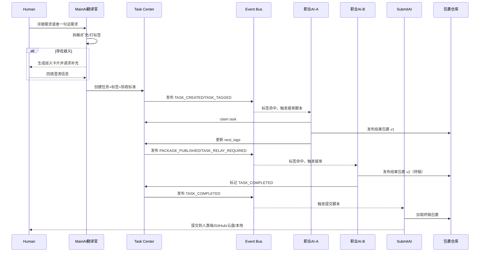

# RelayHive （事务中心模块后端）（V1.0）

> 项目定位：Distributed AI Task Operating System（分布式 AI 任务操作系统）
> 
> 中文代号：蚁巢（Relay + Hive）

---

## 1. 项目定位与目标

### 1.1 项目定位
RelayHive 是一个**面向任务接力的 AI 协作底层架构**，定位类似 AOSP / 小程序容器：
- 不定义“应用内容”本身；
- 只定义“任务如何被规范接力、验证、沉淀、交付”。

### 1.2 核心目标
- 将人类需求转化为可执行的任务链；
- 以标签协议和脚本规则驱动职业 AI 接力；
- 以结果包裹链替代无限上下文；
- 建立接力跑酷模式。

---

## 2. 核心理念与区别于传统 Agent 架构的创新

### 2.1 RelayHive 核心理念
1. **任务流即长期上下文**（不是对话堆栈即上下文）；
2. **阶段成果即长期记忆**（不是向量召回即记忆）；
3. **强协议协作优先于自然语言猜测**；
4. **职业化分工优先于万能 Agent**。

### 2.2 与传统架构对比
| 维度 | 传统单体 Agent | RelayHive |
|---|---|---|
| 协作方式 | 对话驱动 | 事件 + 标签协议驱动 |
| 上下文策略 | 长上下文持续注入 | 结果包裹链 + 胶囊化输入 |
| 扩展模式 | 加提示词 | 新职业AI=标签协议+脚本规则+工具包 |
| 可审计性 | 弱 | 强（任务中心 + 事件总线 + 包裹仓库） |
| 稳定性 | 易循环跑偏 | 通过阶段接力降低漂移 |

### 2.3 关键创新点
- **任务链条权重优先级前缀（非加急等整体任务优先级） + 标注类别中缀＋状态后缀标签协议**（如 ：事务id sj50878 /简介 根据当前gemini最新报道编撰一篇图文ppt / -查询当前gemini最新报道 `#1_search_Done` -根据gemini报道小作文制造三个配套图片`#2_image_TODO` - 打包成ppt文件入库 '#_office_TODO；Done=完成，TODO=待办，IS=故障  等等
- **主AI翻译官机制**：负责拆解/扩充/歧义卡片二次澄清；
- **结果包裹仓库链**：所有阶段产物以版本链保留，支持追溯（包裹仓库→在ui视觉上是右边侧边栏的一个插件模块）；
- **成功失败经验记忆**：只保存“可复用纠偏路径”，不保存污染性失败内容（每个ai成员配套本地简洁版数据库→用于该ai成员储存和查询）。

---

## 3. 项目模块与系统边界说明

### 3.1 系统核心模块
1. **Main AI Translator（主AI翻译官）**
2. **Task Center（事务中心）**
3. **Tag Protocol Engine（标签协议引擎）**
4. **Relay Script Runtime（脚本规则运行时）**
5. **Event Bus（事件总线）**
6. **Result Package Registry（结果包裹仓库）**
7. **Success-Failure Memory（成功失败经验库）**
8. **Delivery Gateway（提交网关：人类端/GitHub/云盘/本地）**

### 3.2 系统边界
**RelayHive 负责：**
- 协议、路由、接力、验收、沉淀、交付。

**RelayHive 不负责：**
- 具体职业 AI 模型训练；
- UI 创意产出本身；
- 某单一业务领域知识正确性兜底。

### 3.3 外部依赖边界
- LLM 服务（多模型）；
- 文件/对象存储；
- 身份认证系统（后续接入）；
- 外部工具能力（MCP、搜索、代码执行等）。

---

## 4. 设计关键点（七大机制）

### 4.1 事务中心（Task Center）
- 任务是唯一调度单元；
- 维护 DAG 依赖、状态机、所有者、包裹引用、审计日志；
- 任务状态建议：`created` → `ready` → `claimed` → `in_progress` → `handover` → `review` → `done` / `blocked` / `failed`。

### 4.2 标签协议（Tag Protocol）→事务链条中每条链条可标注多个标签（一个主标签，可多个副标签）
#### 主标签基础语法
- 结构：`#<链条权重>_<语义标签>[.<状态后缀>]`
- 示例：
  - `#1_search_Done`
  - `#1_office_TODO`
  - `#1_image_IS`
  - `#1_music_Done`
###副标签（提醒类标签）
 -（禁止）（警惕）（建议）（必须）（注意）等等
（#）号＋提醒类标签前缀+内容
示例：#禁止偷懒，#注意细节，#建议md结构

#### 标签层级
1. **中间类别标签**：任务类别（music/office/image/search/vudio/life）→实际用英文形式，特殊注释→若是该类型需要精确分之需要以（主类别/分支）形式例如（Design/UI）（查询/自然灾害）
2. **提醒标签**：约束（禁止联网/警惕流言/建议保存原始）
3. **状态标签**：阶段（TODO/Done/IS）

#### 冲突规则
- 链条优先级权重小者优先（`#1` 高于 `#2`）；
- 同权重冲突按“禁止类 > 允许类”。

### 4.3 交接系统（Handover System）
每次接力必须生成交接包裹元数据：
- 目标、已完成、未完成、待完成、接力建议。

### 4.4 上下文胶囊（Context Capsule）
- 不限制资产体积；
- 但职业 AI 执行时只读取“本棒必要包裹材料”；
- 中途临时产物可废弃（机制只保留24小时→过后自动清理），最终以成果包裹为准。

### 4.5 事件总线（Event Bus）
核心事件：
- `TASK_CREATED`
- `TASK_TAGGED`
- `TASK_RELAY_REQUIRED`
- `TASK_CLAIMED`
- `PACKAGE_PUBLISHED`
- `TASK_COMPLETED`
- `TASK_BLOCKED`
- `AMBIGUITY_CARD_REQUIRED`

### 4.6 结果包裹规范（Result Package Spec）
每个包裹必须包含：
- `package_id`, `task_id`, `version`, `producer_agent`, `input_refs`, `output_manifest`,  `created_at`, `checksum`。

关键规则：
- 以 `task_id + version` 形成可追踪版本链；
- 每次接力递增版本；
- 最低保留 7 天（超过机制自动清理→除非在包裹仓库插件 标记（保留））；
- 允许输出存储到多后端（本地/GitHub/云盘/第三方社交端/手机系统通知）等或其他插件。

### 4.7 每个ai附带失败记忆系统（Success-Failure Memory）
只记录“成功纠偏经验”（也就是 成功的失败经验），如：
- 原路径失败原因（如网址变更）；
- 替代路径为何成功；
- 可复用条件和前置检查项。

不记录易污染模型行为的“失败细节沉迷内容”。

---

## 5. 典型“任务接力”全流程时序图（含角色/AI协作）



流程最小闭环：
1) 人类输入；2) 主AI翻译；3) 任务发布；4) 职业AI接力；5) 包裹迭代；6) 提交AI交付。

---

## 7. 职业 AI 职业细化与扩展可行性设计

### 7.1 接入模板（每新增职业AI必须定义）
1. **标签协议**（对接暗号）
2. **脚本规则**（精确匹配事务）
3. **工具包**（联网/代码/绘图/文案/验证）等等根据不同ai配置符合的能力的工具库
4. **结果包裹格式特化**（该职业的产出字段）
5. **脚本包**（该ai可固化的固定脚本库）
6. **工作桌面**（该ai的所有文件类数据→类似于电脑桌面、或者人类海马体数据化 UI化）

### 7.2 初始职业族建议
- 吉祥物（负责情绪开心＋逗比）、幕后指挥（需求前面加#号才能发给幕后指挥干事）、记者大队（原单一research分裂而成）（暂时成员：科技圈老铁（痴迷科技→负责科技）、金融赌徒阿金（痴迷金融→负责金融）、怕死鬼小豆（痴迷安全→负责周边自然灾害）、学霸眼镜男（痴迷学术→负责学术）之后再扩充）、应用设计室（成员：UI师沫沫（专业ui只会ui→负责ui设计）、重构师古天（专业熟知应用架构→负责诊断调整整体架构），其他之后扩展）、程序员光头佬（只会编程→负责编程）、捣蛋小黑子（破坏的天性→负责给产品上压力测试）、打包大妈（负责将彻底完成的事务→扔到该去的地方）、后勤小美（给个别需要大量上下文干事的ai处理→编撰记忆事务→是重要玩意，需要配置特殊记忆编撰规则）。

### 7.3 扩展原则
- 新职业 AI 只通过协议接入，不改核心调度内核；
- 工具权限最小化（避免“分析AI带联网”类能力越权）；
- 每个职业有独立失败纠偏经验条目。

## 10. 接口/数据规范设计建议

### 10.1 核心数据结构（建议）

#### Task（任务）
```json
{
  "task_id": "task_20260522_0001",
  "title": "登录系统实现",
  "description": "主AI翻译后的可执行任务描述",
  "status": "ready",
  "tags": ["#1_需要设计", "#2_需要编程", "#2_禁止联网"],
  "dependencies": [],
  "owner_agent": null,
  "acceptance_criteria": ["可运行", "通过QA脚本"],
  "created_at": "2026-05-22T11:43:52Z"
}
```

#### Result Package（结果包裹）
```json
{
  "package_id": "pkg_task_20260522_0001_v2",
  "task_id": "task_20260522_0001",
  "version": 2,
  "producer_agent": "CodingAgent",
  "input_refs": ["pkg_task_20260522_0001_v1"],
  "output_manifest": [
    {"path": "outputs/app.py", "sha256": "..."}
  ],
  "qa_summary": {"passed": true, "notes": "smoke test ok"},
  "next_tags": ["#1_等待验收"],
  "created_at": "2026-05-22T12:10:00Z",
  "checksum": "sha256:..."
}
```

### 10.2 API 草案
- `POST /v1/tasks`：创建任务（主AI翻译官调用）
- `POST /v1/tasks/{task_id}/claim`：职业AI接单
- `POST /v1/tasks/{task_id}/packages`：发布结果包裹
- `POST /v1/tasks/{task_id}/relay`：触发接力
- `POST /v1/tasks/{task_id}/complete`：终结任务
- `GET /v1/tasks/{task_id}/timeline`：查看任务接力时间线
- `GET /v1/packages/{package_id}`：查询包裹详情

### 10.3 事件规范建议
统一事件头：
- `event_id`, `event_type`, `task_id`, `actor`, `timestamp`, `idempotency_key`, `payload_version`。

## 附录 ：一句话总结

RelayHive 的目标不是制造“记住一切的超级脑”，而是打造“能稳定交接工作的 AI 协作操作系统”。
